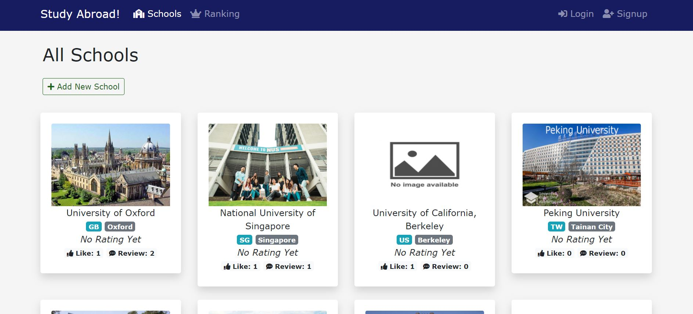
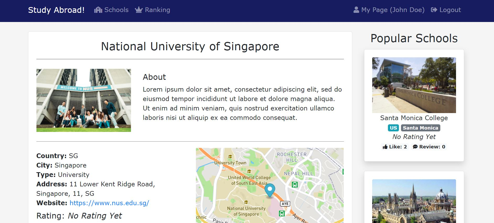

# Study Abroad!
This application is the platform where you can find excellent schools, including but not limited to University, College, Language schools in the world! In addition, there are many reviews of each school that would help you decide the place you study in.

---
## URL
https://study-abroad-2020.herokuapp.com/

## Images
#### Landing Page


#### School List Page


#### School Detail Page


#### Profile Page


## Getting Started
- copy this project into your local machine
- install npm
```
npm install 
```
- launch app
```
npm start
```

## Tech Used
Front End
- Bootstrap

Back End
- Node.js
- Express
- MongoDB
- Mongoose

APIs
- Passport (Authentication)
- Cloudinary (Images Storage)
- MapQuest (Map)
- Mailtrap (Email)

## Author
Takuto Okamoto

## License
[MIT](https://choosealicense.com/licenses/mit/)